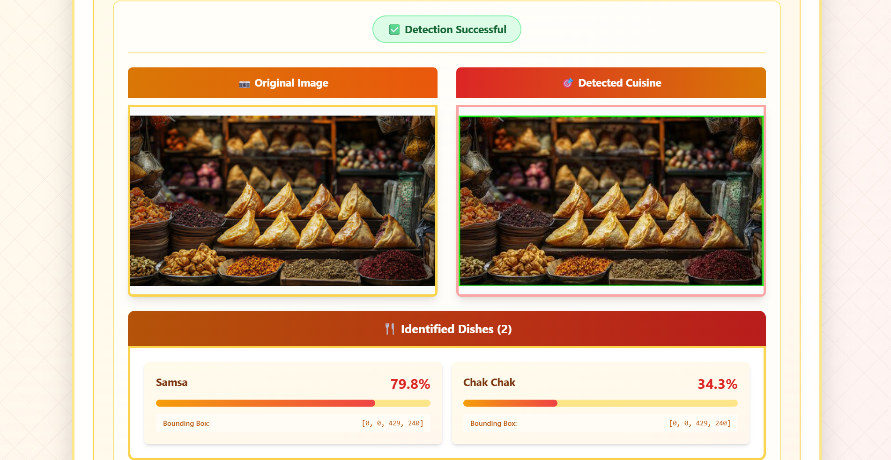

# BentoVision

## Overview

BentoVision is a deep learning application that leverages the Convolutional Neural Network (CNN) model based in YOLOv8 to identify and classify cuisine specifically  found in Central and Eastern Asia. This model is capable of accurately detecting and classifying 42 unique kinds of Asian cuisine with over 90% accuracy on all images in testing dataset. 

## Preview

## Data

This deep learning model was trained on 17,000+ unique images of Asian dishes provided by Issai through HuggingFace. This is the link to the provided dataset on HuggingFace: https://huggingface.co/datasets/issai/Central_Asian_Food_Dataset

## Tech Stack:

- Python
- PyTorch
- YOLOv8
- OpenCV
- HuggingFace
- Typescript
- React
- Tailwind CSS

## AWS Deployment

This model is dockerized and contained as a microservice through AWS ECR and Lambda, and exposed for use through Amazon's API Gateway. This model's deployment is hosted on Netlify and can be found in this link below: https://bento-vision.netlify.app/

